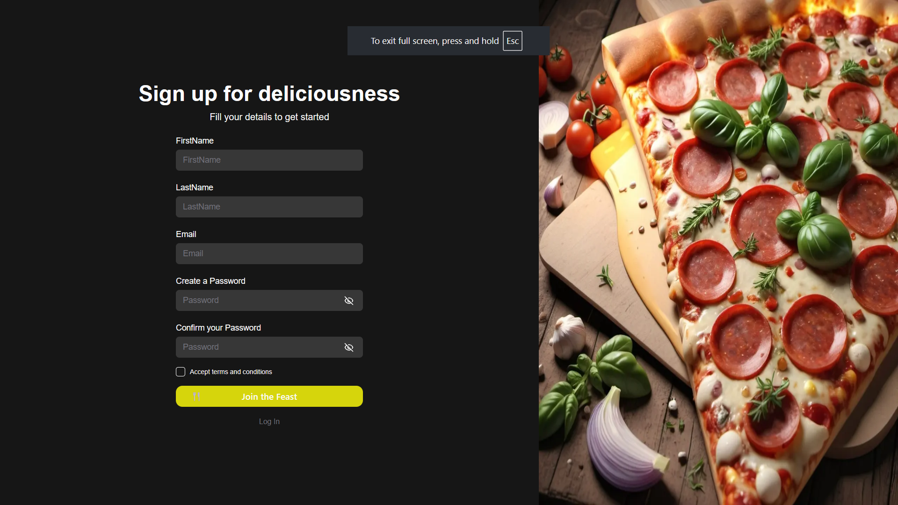
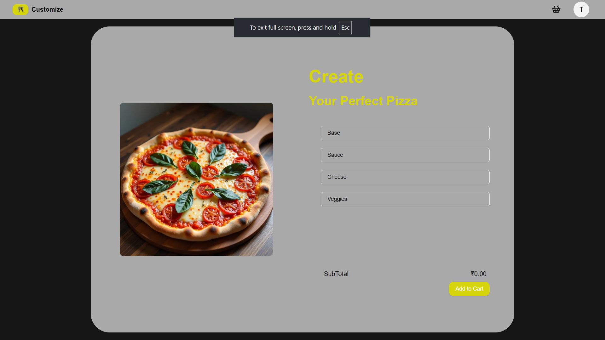
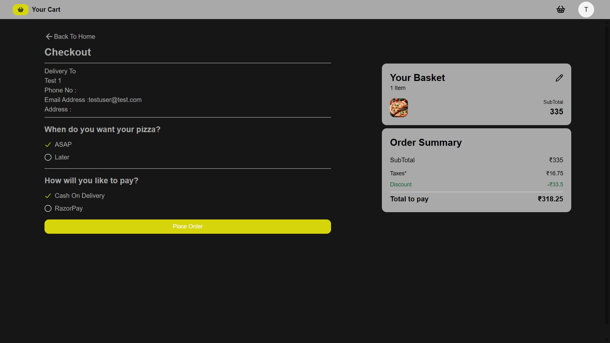
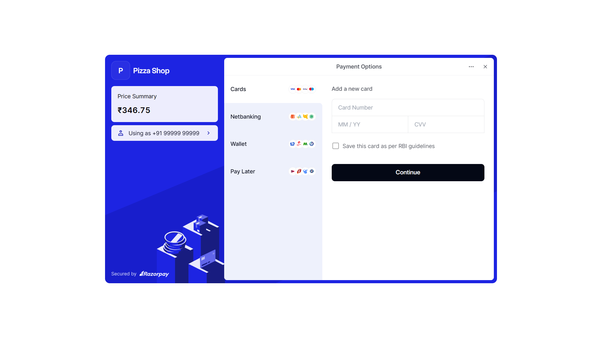
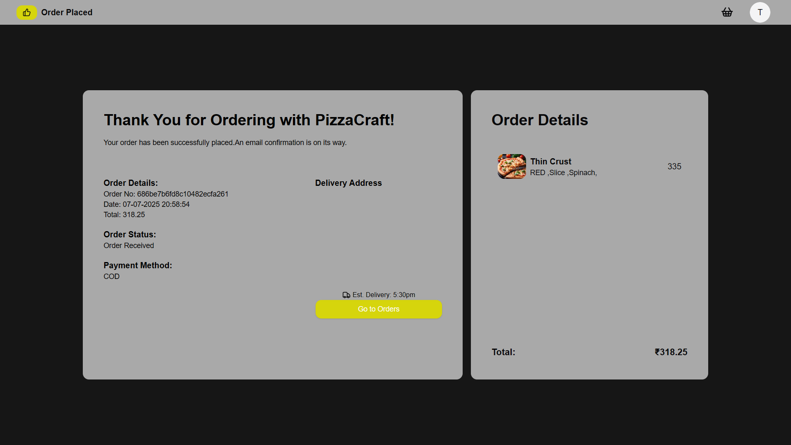
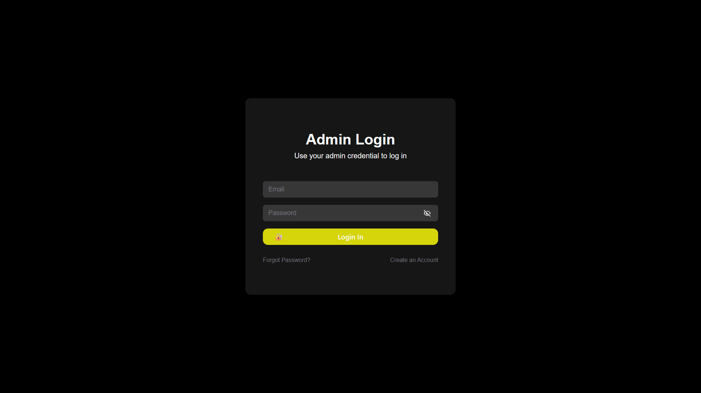
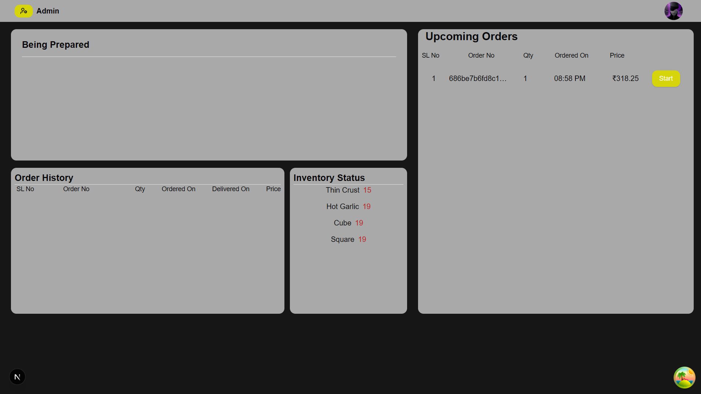
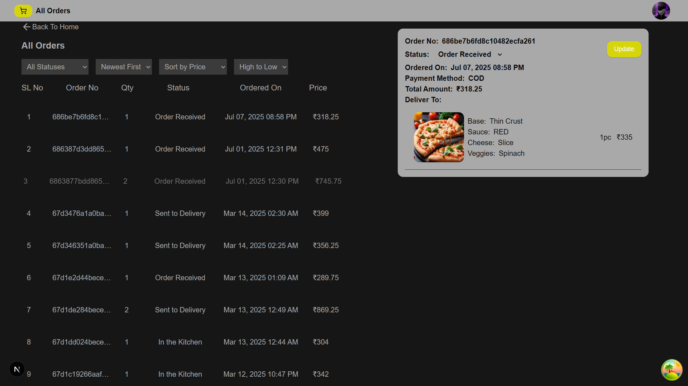
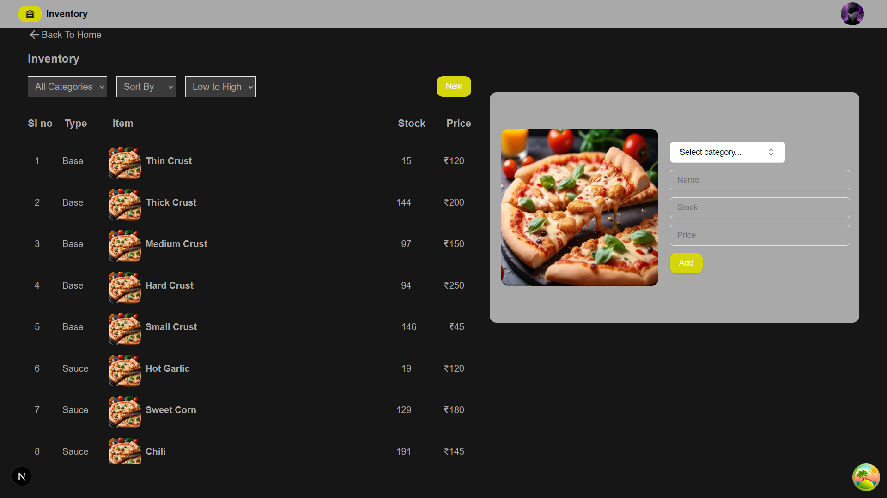

# 🍕 Pizza Delivery Web App

A full-stack pizza delivery application with secure user and admin login, cart management, Razorpay demo payments, and email verification.

🔗 **Live Demo**: [pizza-deliverysumesh.vercel.app](https://pizza-deliverysumesh.vercel.app/user)  
🧪 **Test User Credentials**:
- **Email:** `testuser@test.com`
- **Password:** `123456`

---

## ⚙️ Tech Stack

**Frontend**
- [Next.js](https://nextjs.org/) — React-based framework for server-side rendering
- [Zustand](https://github.com/pmndrs/zustand) — Lightweight state management
- [TanStack Query](https://tanstack.com/query) — Data fetching and caching

**Backend**
- [Node.js](https://nodejs.org/) — JavaScript runtime
- [Express.js](https://expressjs.com/) — REST API backend
- [MongoDB](https://www.mongodb.com/) — NoSQL document database

**Deployment**
- **Frontend**: [Vercel](https://vercel.com)  
- **Backend**: [Render](https://render.com)

**Other Integrations**
- [Razorpay](https://razorpay.com/) for test payments (demo mode only)
- [Ethereal Email](https://ethereal.email/) for email testing (verification & forgot password)
- JWT Authentication

---

## ✨ Features

### 👥 Authentication
- ✅ User Registration with Email Verification
- ✅ Secure Login (User & Admin)
- ✅ Forgot Password via Email
- ✅ JWT-based Auth with Role Handling

### 🛒 User Functionality
- ✅ Browse Pizzas by Category
- ✅ Add/Remove Items from Cart
- ✅ Place Orders & View Order History
- ✅ Razorpay Payment Integration (Demo)

### 🛠️ Admin Functionality
- ✅ Separate Admin Login
- ✅ Add/Edit/Delete Pizza Items
- ✅ View All Orders
- ✅ Manage Order Status

---

## 🧪 Test It Yourself

```bash
User Email: testuser@test.com
Password: 123456

Admin Email: testadmin@test.com
Password: 123456
```

## 📷 Screenshots

### 🏠 Home Page  


---

### 🔐 User Login Page  


---

### 🍕 Create Pizza Page (Admin)  


---

### 🛒 Cart View  


---

### 💳 Razorpay Payment Gateway  


---

### ✅ Order Confirmation  


---

### 📦 User Order History  


---

### 🔐 Admin Login Page  


---

### 🧑‍🍳 Admin Dashboard  


---

### 📋 Admin Order Management  


---

### 🗃️ Admin Inventory Management  



## Badges


